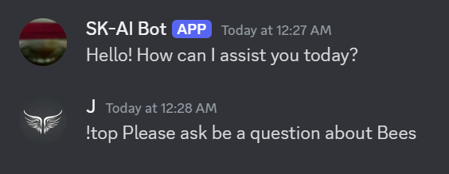
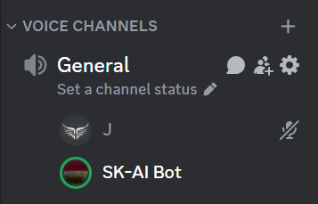
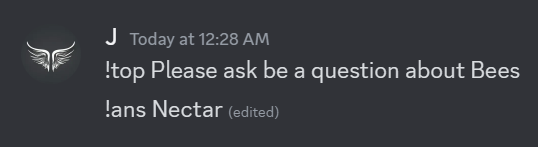

<a id="readme-top"></a>

<!-- PROJECT LOGO -->
<br />
<div align="center">
  <a href="https://github.com/jamesrrdev/discord-AI_TTS-Trivia-Bot">
    
  </a>

  <h3 align="center">Discord OpenAI Trivia Bot</h3>

  <p align="center">
    A discord bot utilizing OpenAI's GPT-4o-mini API to host trivia on any topic you can imagine!
    <br />
    <a href="https://github.com/jamesrrdev/discord-AI_TTS-Trivia-Bot"><strong>Explore the docs »</strong></a>
    <br />
    <br />
    <a href="https://github.com/jamesrrdev/discord-AI_TTS-Trivia-Bot">View Demo</a>
    ·
    <a href="https://github.com/jamesrrdev/discord-AI_TTS-Trivia-Bot/issues/new?labels=bug&template=bug-report---.md">Report Bug</a>
    ·
    <a href="https://github.com/jamesrrdev/discord-AI_TTS-Trivia-Bot/issues/new?labels=enhancement&template=feature-request---.md">Request Feature</a>
  </p>
</div>


<!-- TABLE OF CONTENTS -->
<details>
  <summary>Table of Contents</summary>
  <ol>
    <li>
      <a href="#about-the-project">About The Project</a>
      <ul>
        <li><a href="#built-with">Built With</a></li>
      </ul>
    </li>
    <li>
      <a href="#getting-started">Getting Started</a>
      <ul>
        <li><a href="#prerequisites">Prerequisites</a></li>
        <li><a href="#installation">Installation</a></li>
      </ul>
    </li>
    <li><a href="#usage">Usage</a></li>
    <li><a href="#roadmap">Roadmap</a></li>
    <li><a href="#contributing">Contributing</a></li>
    <li><a href="#license">License</a></li>
    <li><a href="#contact">Contact</a></li>
    <li><a href="#acknowledgments">Acknowledgments</a></li>
  </ol>
</details>


<!-- ABOUT THE PROJECT -->
## About The Project

This is a project that utilizes OpenAI's API and DougDoug's Babagaboosh to create a Discord bot that is able to create an ambigious Trivia game for users to play with. The bot will repeat the Trivia through TTS.

This bot also supports normal chatting and prompting with OpenAI, with and without message history!

Disclaimer: Right now the Project's scale is intended for a small server of 5-10 TRUSTED people. I will need to work on making the commands Admin-only. If you have suggestions or needs for scaling please let me know!

Features:
* Trivia commands such as !top and !ans.
* Normal AI prompting with !p, !ph and !ptts.
* See !help for more info on these commands!

<p align="right">(<a href="#readme-top">back to top</a>)</p>


### Built With

* [![Python][Python.org]][Python-url]
* [![Nextcord][Nextcord.dev]][Nextcord-url]
* [![OpenAI][OpenAI.com]][OpenAI-url]

<p align="right">(<a href="#readme-top">back to top</a>)</p>

<!-- GETTING STARTED -->
## Getting Started

Before downloading please acknowledge that this software uses GPT-4o mini using OpenAI's API which requires account funds.

Please review OpenAI's API pricing here: [https://openai.com/api/pricing/](https://openai.com/api/pricing/)

To get a local copy up and running follow these steps.

### Prerequisites

This is an example of how to list things you need to use the software and how to install them.
* OpenAI API Key

  Your OpenAI API Key can be found here: [https://platform.openai.com/api-keys](https://platform.openai.com/api-keys)

* Create a Discord Application/Bot and create Token

  You can create your discord bot here: [https://discord.com/developers/applications](https://discord.com/developers/applications)

  The Token/API Key will be found under the "Bot" tab

* ffmpeg  

  Used for audio files, download here: [https://www.ffmpeg.org](https://www.ffmpeg.org)

  1. Click 'Download' Button
  2. Click Windows button under 'More Downloading Options'
  3. Click 'Windows builds by BtBn'
  4. Download the latest version of ffmpeg-master-lastest-win64-gpl.zip

<p align="right">(<a href="#readme-top">back to top</a>)</p>

### Installation

#### SECURITY WARNING ⚠️ IMPORTANT:

When using this software, be cautious about how you handle API keys and other sensitive information:

* If others will see your files, never commit your API keys, passwords, or any other sensitive credentials directly into the codebase.
* Use environment variables or configuration files.

1. Clone the repo
   ```sh
   git clone https://github.com/jamesrrdev/discord-AI_TTS-Trivia-Bot.git
   ```
2. Enter your API Keys/Tokens in `config.py`

   Direct
   ```py
   DISCORD_BOT_TOKEN = 'ENTER YOUR KEY'
   OPEN_AI_KEY = 'ENTER YOUR KEY'
   ```

   Windows Environment Variable
   ```py
   DISCORD_BOT_TOKEN = os.environ.get('ENTER YOUR VARIABLE NAME')
   OPEN_AI_KEY = os.environ.get('ENTER YOUR VARIABLE NAME')
   ```
   
3. Install FFMPEG

   * Extract ZIP file
   * Go into the 'bin' folder
   * Paste files from 'bin' to 'ffmpeg' folder in repository
  
4. Run program
  ```sh
   python3 app.py
   ```

5. (Optional) Tweak Config File as Needed
  Please go over the config file for anything to better suit your needs.

<p align="right">(<a href="#readme-top">back to top</a>)</p>


<!-- USAGE EXAMPLES -->
## Usage

Give the Bot a Trivia Topic



The Bot responds in VC



The User Answers the Question



The Bot tells you if you are Right or Wrong


<p align="right">(<a href="#readme-top">back to top</a>)</p>


<!-- ROADMAP -->
## Roadmap

- [ ] Set command permissions
- [ ] Allow users to modify the config file within Discord Commands
- [ ] Add a configurate School-Grade level to questions
- [ ] Add more personality modules
    - [X] Skeptic
    - [ ] Angry
    - [ ] Surfer Bro

See the [open issues](https://github.com/jamesrrdev/discord-AI_TTS-Trivia-Bot/issues) for a full list of proposed features (and known issues).

<p align="right">(<a href="#readme-top">back to top</a>)</p>


<!-- CONTRIBUTING -->
## Contributing

Contributions are what make the open source community such an amazing place to learn, inspire, and create. Any contributions you make are **greatly appreciated**.

If you have a suggestion that would make this better, please fork the repo and create a pull request. You can also simply open an issue with the tag "enhancement".
Don't forget to give the project a star! Thanks again!

1. Fork the Project
2. Create your Feature Branch (`git checkout -b feature/AmazingFeature`)
3. Commit your Changes (`git commit -m 'Add some AmazingFeature'`)
4. Push to the Branch (`git push origin feature/AmazingFeature`)
5. Open a Pull Request

<!-- LICENSE -->
## License

Distributed under the MIT License. See `LICENSE.txt` for more information.

<p align="right">(<a href="#readme-top">back to top</a>)</p>


<!-- CONTACT -->
## Contact

You can best get through to me on Discord, if you need help feel free to reach out!

Discord Username: james_sk

Project Link: [https://github.com/jamesrrdev/discord-AI_TTS-Trivia-Bot](https://github.com/jamesrrdev/discord-AI_TTS-Trivia-Bot)

<p align="right">(<a href="#readme-top">back to top</a>)</p>


<!-- ACKNOWLEDGMENTS -->
## Acknowledgments

Some cool resources that helped with this project!

* [Babagaboosh - Verbal Conversation with OpenAI](https://github.com/DougDougGithub/Babagaboosh)

<p align="right">(<a href="#readme-top">back to top</a>)</p>


<!-- MARKDOWN LINKS & IMAGES -->
<!-- https://www.markdownguide.org/basic-syntax/#reference-style-links -->
[Python.org]: https://img.shields.io/badge/Python-000000?style=for-the-badge&logo=python&logoColor=yellow
[Python-url]: https://www.python.org
[Next.js]: https://img.shields.io/badge/next.js-000000?style=for-the-badge&logo=nextdotjs&logoColor=white
[Next-url]: https://nextjs.org/
[Nextcord.dev]: https://img.shields.io/badge/Nextcord-000000?style=for-the-badge&logo=discord&logoColor=blue
[Nextcord-url]: https://nextcord.dev
[OpenAI.com]: https://img.shields.io/badge/OpenAI-000000?style=for-the-badge&logo=openai&logoColor=white
[OpenAI-url]: https://platform.openai.com
